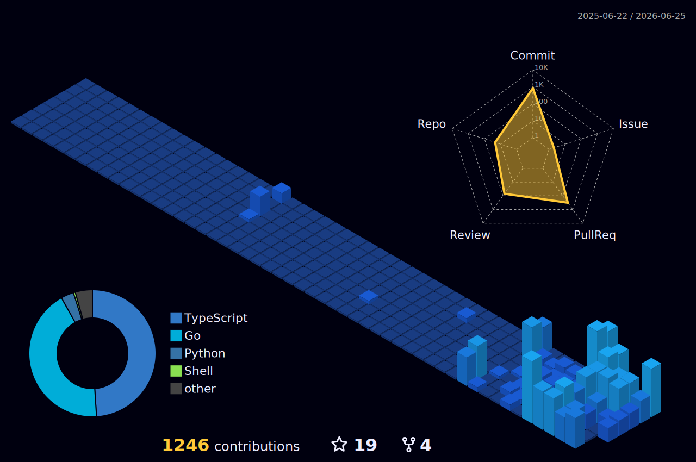

<h1 align="center">Mayur Das</h1>

  <b>Go systems engineer</b> &nbsp;·&nbsp; containers &nbsp;·&nbsp; Kubernetes &nbsp;·&nbsp; LLM infrastructure

  I build low-level infra in Go — container runtimes, distributed schedulers, and the plumbing that keeps LLM inference fast and cheap.

  

---

### 🛠️ What I build

| Project | What it is |
| --- | --- |
| [**leanmcp**](https://github.com/mayur-tolexo/leanmcp) | Transparent MCP-to-MCP proxy that *losslessly* slims heavy tool-call responses to cut LLM token usage, with expand-on-demand. |
| [**kubetidy**](https://github.com/mayur-tolexo/kubetidy) | Kubernetes-native CLI that scores cluster efficiency, quantifies wasted spend in real dollars, and gives evidence-backed rightsizing recommendations. |
| [**ortrix**](https://github.com/mayur-tolexo/ortrix) | Low-latency, Kubernetes-native distributed workflow orchestrator — partitioned execution, streaming task dispatch, locality-aware scheduling. |
| [**gpu-pipeline**](https://github.com/mayur-tolexo/gpu-pipeline) | Elastic GPU telemetry pipeline with a custom distributed message queue, built in Go and deployable on Kubernetes via Helm. |
| [**tunnl**](https://github.com/mayur-tolexo/tunnl) | Self-hosted tunnel relay — a `tunnl http 3000` client + public-VPS relay sharing a wildcard cert. |
| [**sworker**](https://github.com/mayur-tolexo/sworker) · [**pg-shifter**](https://github.com/mayur-tolexo/pg-shifter) | Go libraries: dead-simple worker pools, and a struct→Postgres schema shifter. |

### 🌍 Open-source contributions

Working upstream on the container & inference stack:

- [**containerd/nerdctl**](https://github.com/containerd/nerdctl) — `-t -d -i` TTY handling ([#4989](https://github.com/containerd/nerdctl/pull/4989)) and `--mount type=image` ([#4990](https://github.com/containerd/nerdctl/pull/4990))
- [**google/gvisor**](https://github.com/google/gvisor) — `max_user_namespaces` sysctl support + enforcement ([#13539](https://github.com/google/gvisor/pull/13539))
- [**vllm-project/vllm**](https://github.com/vllm-project/vllm) · [**llm-d**](https://github.com/llm-d) · [**containerd**](https://github.com/containerd/containerd) — LLM serving & runtime internals

---

### 👾 Contribution arcade

<picture>
  <source media="(prefers-color-scheme: dark)" srcset="https://raw.githubusercontent.com/mayur-tolexo/mayur-tolexo/output/pacman-dark.svg" />
  <source media="(prefers-color-scheme: light)" srcset="https://raw.githubusercontent.com/mayur-tolexo/mayur-tolexo/output/pacman.svg" />
  
</picture>

### 📊 The numbers

  
  

  

### 🧊 Contributions in 3D

### 🧬 Metrics

---

### ✍️ Latest writing
<!-- BLOG-POST-LIST:START -->
- [Maximizing Your Wealth: Using a Car Loan Strategically](https://medium.com/@mayur.das4/maximizing-your-wealth-using-a-car-loan-strategically-185f92a97c67?source=rss-9b662ba980c2------2)
- [Generate RESTful API documentation by integration swagger](https://medium.com/@mayur.das4/generate-restful-api-documentation-by-integration-swagger-baa52aefd2dd?source=rss-9b662ba980c2------2)
<!-- BLOG-POST-LIST:END -->

### 🤝 Connect

  
  
  

