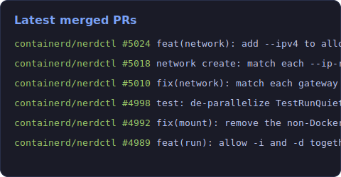

<h1 align="center">Mayur Das</h1>

<p align="center">
  <a href="https://github.com/mayur-tolexo">
    
  </a>
</p>

```ansi
╭───────────────────────────────────────────────────────────
│ mayur@github
├───────────────────────────────────────────────────────────
│ Role        Go systems engineer
│ Focus       containers · Kubernetes · LLM infrastructure
│ Runtime     containerd · gVisor · runc
│ Orchestr    kubernetes · helm
│ Inference   vLLM · llm-d
│ Langs       Go (primary) · Python · TypeScript · Shell
│ Editor      nvim · zsh
│ Uptime      11+ yrs shipping Go in prod
│ Fun fact    debugging is just printf with extra steps
╰───────────────────────────────────────────────────────────
```

<p align="center">
  
  <a href="https://github.com/mayur-tolexo?tab=followers"></a>
</p>

---

### 🛠️ What I build

| Project | What it is |
| --- | --- |
| [**leanmcp**](https://github.com/mayur-tolexo/leanmcp) | Transparent MCP-to-MCP proxy that *losslessly* slims heavy tool-call responses to cut LLM token usage, with expand-on-demand. |
| [**kubetidy**](https://github.com/mayur-tolexo/kubetidy) | Kubernetes-native CLI that scores cluster efficiency, quantifies wasted spend in real dollars, and gives evidence-backed rightsizing recommendations. |
| [**gpu-pipeline**](https://github.com/mayur-tolexo/gpu-pipeline) | Elastic GPU telemetry pipeline with a custom distributed message queue, built in Go and deployable on Kubernetes via Helm. |
| [**tunnl**](https://github.com/mayur-tolexo/tunnl) | Self-hosted tunnel relay — a `tunnl http 3000` client + public-VPS relay sharing a wildcard cert. |
| [**sworker**](https://github.com/mayur-tolexo/sworker) · [**pg-shifter**](https://github.com/mayur-tolexo/pg-shifter) | Go libraries: dead-simple worker pools, and a struct→Postgres schema shifter. |

### 🌍 Open-source contributions

Upstream work on the container & inference stack. The card below is generated by my own Go tool ([`tools/osscard`](./tools/osscard)) that queries the GitHub API for my merged PRs and renders the SVG — refreshed nightly.



Browse everything per project:

- [**containerd/nerdctl**](https://github.com/containerd/nerdctl/pulls?q=is%3Apr+author%3Amayur-tolexo)
- [**google/gvisor**](https://github.com/google/gvisor/pulls?q=is%3Apr+author%3Amayur-tolexo)
- [**containerd/containerd**](https://github.com/containerd/containerd/pulls?q=is%3Apr+author%3Amayur-tolexo)
- [**llm-d**](https://github.com/search?q=is%3Apr+author%3Amayur-tolexo+org%3Allm-d&type=pullrequests)

---

### 👾 Contribution arcade

<picture>
  <source media="(prefers-color-scheme: dark)" srcset="https://raw.githubusercontent.com/mayur-tolexo/mayur-tolexo/output/pacman-contribution-graph-dark.svg" />
  <source media="(prefers-color-scheme: light)" srcset="https://raw.githubusercontent.com/mayur-tolexo/mayur-tolexo/output/pacman-contribution-graph.svg" />
  
</picture>

### 📊 The numbers

<p align="center">
  
  
</p>
<p align="center">
  
</p>

---

### 🤝 Connect

<p align="left">
  <a href="https://linkedin.com/in/mayurdaeron" target="_blank"></a>
  <a href="https://medium.com/@mayur.das4" target="_blank"></a>
  <a href="mailto:mayur.das4@gmail.com"></a>
</p>
